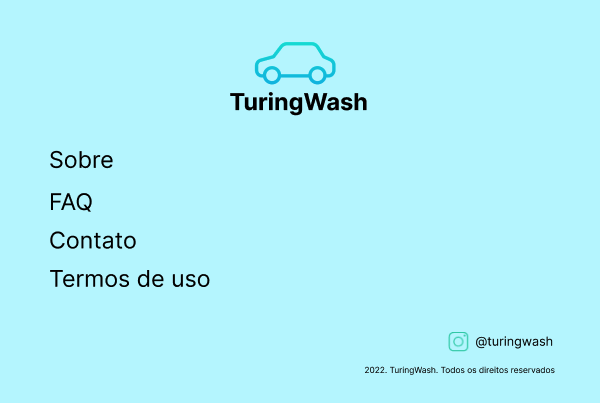

# Tarefa - Semana 3: Deixando nossa interface responsiva para todos os tipos de telas

Saudações, estudante do nosso bootcamp! Esta é a 3ª tarefa do nosso segundo mês do nosso Bootcamp Full Stack Developer do ITuring. Como você já sabe, reforçando, nossas tarefas serão orientadas para você desenvolver um projeto de front-end.

## Sobre a tarefa

Na tarefa da Semana 3 do **Mês 2 - Dominando Front-End**, teremos as seguintes etapas:

- **[Etapa 1:](#etapa-1-adicionando-responsividade-no-rodapé)** Adicionando responsividade nos elementos do rodapé (`<footer>`)
- **[Etapa 2:](#etapa-2-adicionando-responsividade-no-conteúdo-principal-da-página-pedirlavagemhtml)** Adicionando responsividade nos elementos do conteúdo principal da página `pedirlavagem.html`
- **[Etapa 3 (opcional):](#etapa-3-opcional-adicionando-responsividade-nos-elementos-do-cabeçalho-header)** Adicionando responsividade nos elementos do cabeçalho (`<header>`)
- **[Enviando sua tarefa no Discord](#enviando-a-sua-tarefa-no-discord)** 

## Etapa 1: Adicionando responsividade nos elementos do rodapé

Antes de você iniciar o desenvolvimento, tenha sempre em mãos os links que disponibilizamos para as telas e user stories do projeto TuringWash:
- [Design das telas no Figma](https://www.figma.com/file/vLxv5eN0RWQTCIniGv2U9y/Turing-Wash?node-id=0%3A1)
- [Escopo do projeto (user stories) e telas no Miro](https://miro.com/welcomeonboard/MjI5NHp5dHd4MXFRVlZhVVFkY1NIcmZTZGk2OHpsa1MyZXg1TjMxMHk2VGNoSW9JS1N3MERmV3BZamlBa1ZwM3wzNDU4NzY0NTMyNDc5MDQzNjU0?share_link_id=28296698674)

Na semana 2 do mês 2, você fez o seguinte:
1. Definiu as classes das telas e criou os primeiros códigos de CSS
2. Colocou o código CSS em um arquivo separado e conectando com as páginas
3. Dimensionou e posicionou todos os elementos da interface das páginas

A sua organização após a finalização da Semana 2 do Mês 2 do bootcamp ficou algo semelhante a:

```
📦 bootcamp-full-stack-ituring
 ┗ 📂 mes-1-logica-de-programacao
 ┗ 📂 mes-2-dominando-frontend
   ┗ 📂 resumos
     ┣ 📜 resumo-semana-1.md
     ┗ 📜 resumo-semana-2.md
```

```
📦 turingwash-frontend
 ┣ 📜 pedirlavagem.html
 ┣ 📜 meuscarros.html
 ┣ 📜 adicionarcarro.html (opcional)
 ┣ 📜 minhaslavagens.html (opcional)
 ┣ 📂 css (ou styles)
    ┗ 📜 styles.css
 ┣ 📂 js (ou scripts)
 ┗ 📂 img (ou images)
    ┣ 🖼️ profile.png
    ┣ 🖼️ turingwash-icon.svg
    ┗ 🖼️ turingwash-logo.svg
```

**Importante 1:** a tarefa da Semana 3 do Mês 2 será entregue no mesmo repositório do projeto e não teremos nenhum arquivo adicional para acrescentar. Porém, caso queira (e recomendamos!), fique à vontade de normalizar o seu CSS e adicionar o arquivo `normalize.css` na pasta `css` (ou `styles`), conforme instruído em aula.

**Importante 2:** caso o seu arquivo CSS esteja muito grande e/ou difícil de gerenciar, confira a dica deixada pelo instrutor sobre como organizar seus códigos CSS. Fique à vontade de criar mais arquivos CSS e conectá-los para deixar seu código CSS melhor organizado.

Dessa vez, a sua missão será de deixar as interfaces da aplicação TuringWash completamente responsivas, ou seja, elas devem atender a todos os tipos de telas. Para isso, veja User Story 4 no [nosso Miro](https://miro.com/welcomeonboard/MjI5NHp5dHd4MXFRVlZhVVFkY1NIcmZTZGk2OHpsa1MyZXg1TjMxMHk2VGNoSW9JS1N3MERmV3BZamlBa1ZwM3wzNDU4NzY0NTMyNDc5MDQzNjU0?share_link_id=28296698674) para que você possa implementar esta solução:
```
Feature 4: Interface completamente responsiva

**Como** pessoa dona do TuringWash
**Quero** que meus clientes consigam navegar perfeitamente pelo site com o celular
**Para** garantir a melhor experiência de usuário possível e benefícios de SEO
```

Nesta 1ª etapa, você deverá trabalhar para deixar os elementos do rodapé do site (`<footer>`) completamente responsivos. Confira no [nosso Figma](https://www.figma.com/file/vLxv5eN0RWQTCIniGv2U9y/Turing-Wash?node-id=0%3A1) como deve ficar o rodapé para telas de tamanho menor ou igual ao de um celular. Isto é, telas menores ou iguais a `768px` de largura. Veja também aqui como deve ser o resultado final:



Lembre-se do [uso de media queries](https://www.youtube.com/watch?v=YsARn_wxFvY&t=2930s) para gerar a quebra e assim poder estilizar os elementos adequadamente de forma que eles fiquem posicionados como definido no Figma, além dos outros recursos, como medidas relativas, flexbox, grid, etc.

Verifique se a sua solução realmente está responsiva variando a largura da janela do seu navegador ou usando o DevTools para diferentes telas.

**O de sempre:** nunca se esqueça de estar sempre testando e comitando o seu código.

## Etapa 2: Adicionando responsividade no conteúdo principal da página `pedirlavagem.html`

Agora é o momento de adicionar responsividade no conteúdo principal da página `pedirlavagem.html`.

Você pode conferir no [nosso Figma](https://www.figma.com/file/vLxv5eN0RWQTCIniGv2U9y/Turing-Wash?node-id=0%3A1) como deve ficar o conteúdo principal da página `pedirlavagem.html` para telas de tamanho menor ou igual ao de um celular. Ou seja, telas menores ou iguais a `768px` de largura.

Verifique se a sua solução realmente está responsiva variando a largura da janela do seu navegador ou usando o DevTools para diferentes telas.

**O de sempre:** nunca se esqueça de estar sempre testando e comitando o seu código.

## Etapa 3 (Opcional): Adicionando responsividade nos elementos do cabeçalho (`<header>`)

Sobrou um tempo extra essa semana? Então agora é o momento de adicionar responsividade nos elementos do cabeçalho da página. Para o cabeçalho, você deverá criar um menu hamburguer, que nada mais é que aquele ícone de três listras que, ao clicar, um menu lateral deslizante aparece na tela. Veja aqui como deve ser o resultado final:


Veja também no [nosso Figma](https://www.figma.com/file/vLxv5eN0RWQTCIniGv2U9y/Turing-Wash?node-id=0%3A1) como deve ficar o menu deslizante.

Agora é um momento crítico. Desenvolver um menu hamburguer com CSS do zero não é trivial e requer alguns conhecimentos de animação em CSS. Basicamente, em CSS você pode criar animação em elementos com as propredades [`transform`](https://www.w3schools.com/cssref/css3_pr_transform.asp) e [`transition`](https://www.w3schools.com/cssref/css3_pr_transition.asp). Com apenas essas duas propriedades, você pode fazer muita coisa incrível de animação.

Mas, o ponto aqui é que você não precisa entender de animação em CSS por completo para implementar um menu hamburguer. Mas, como? Bom, agora vamos treinar sua capacidade de aproveitar códigos da internet. Ou seja, pegar um código na internet, adaptar e tentar aplicar no seu código. Não tem problema se você não conseguir aplicar perfeitamente ou simplesmente não conseguir aplicar. Conte com a gente no Discord que vamos te ajudar ao máximo. Pesquise por `menu hamburger pure css` e busque por uma solução do menu hamburguer, ou então tente utilizar [esta solução aqui](https://codepen.io/erikterwan/pen/EVzeRP).

Algumas dicas direcionadas para te ajudar a implementar a solução no seu código (no caso, parte da dica está orientada para a [solução que sugerimos utilizar](https://codepen.io/erikterwan/pen/EVzeRP)):
1. Busque entender no macro como a solução que você vai utilizar é implementada, quais elementos são utilizados e como eles são estilizados no CSS
1. Tente fazer alguns ajustes no código da solução na sua máquina local para ver como a solução se comporta na sua tela. Vai futucando, alterando e entendendo o comportamento e a lógica por trás
1. Compreendeu um pouco a lógica? Agora é o momento de tentar encaixar a solução no seu código. Copie o HTML da solução e coloque exatamente onde deveria ficar o seu menu hamburguer em um dos seus arquivos `.html`. Recomendamos o `pedirlavagem.html`, mas fique à vontade de testar em qualquer um
1. Da mesma forma, copie o CSS da solução e coloque no seu arquivo CSS. Garanta que todos os nomes de classe da solução não seja igual a nenhum nome de classe que você tenha definido, caso contrário pode ocorrer conflitos, nada funcionar e ficar uma bagunça
1. Agora veja se apareceu alguma coisa e se o menu está funcionando de alguma forma. Ou seja, se ao clicar no ícone do menu hamburguer, um menu de alguma forma aparece. E, ao clicar para fechar, o menu é fechado
1. Se não funcionou, tente debugar o código e ver o que está quebrando a funcionalidade. Vai analisando cada estilo aplicado da funcionalidade. Vai tentando ajustar até que funcione completamente
1. Se funcionou completamente, parabéns! Agora tente ajustar a funcionalidade do menu hamburguer de forma que ele preencha toda a tela ao ser clicado. Além disso, garanta também que as cores, família da fonte, etc, sejam o mesmo da nossa aplicação TuringWash e que a cor do botão do menu hamburguer seja sempre preta, ao invés de branca e depois preta como [na solução](https://codepen.io/erikterwan/pen/EVzeRP)
1. Bom, o ícone do menu hamburguer está sempre aparecendo? Pois é, ele só deve aparecer caso o tamanho de tela seja de celular, certo? Neste caso, pesquise por `display none` no Google e garanta que o menu hamburguer não apareça na página caso a largura de tela seja maior que a de um celular. Ou seja, media queries aí
1. Agora refatore (ou seja, reestruture) a solução que você utilizou para que ela fique no padrão BEM e faça qualquer ajuste na estrutura do código que achar necessário para seguir o seu padrão de código. Lembre-se sempre de deixar o seu código bonito e de fácil leitura

Você deve estar se perguntando, "eu devo aprender mais sobre animações em CSS?". De um modo geral, não é essencial, mas é um conhecimento bacana de se adquirir. Você pode ir adquirindo aos poucos. Se sobrar um tempo, busque entender a fundo como funcionou a animação implementada na solução do menu hamburguer que você utilizou no seu código. Entenda por inteiro, "tin tin por tin tin".

Não esqueça de verificar se a sua solução realmente está responsiva variando a largura da janela do seu navegador ou usando o DevTools para diferentes telas.

**O de sempre:** nunca se esqueça de estar sempre testando e comitando o seu código.

## Enviando a sua tarefa no Discord

Pronto, ufa! Se você chegou até aqui e terminou a tarefa dessa semana, parabéns!!! 👏

Para enviar a tarefa, basta copiar o link do seu repositório `turingwash-frontend` no GitHub e colar no formulário solicitado no [Discord do curso](https://discord.gg/FXage6t99U) no canal **#💪 │ tarefa-semana-3** do **Mês 2 - Dominando Front-End**.

Ao final de todas as etapas, o seu repositório deverá ter as seguintes pastas e arquivos:

```
📦 turingwash-frontend
 ┣ 📜 pedirlavagem.html
 ┣ 📜 meuscarros.html (opcional)
 ┣ 📜 adicionarcarro.html (opcional)
 ┣ 📜 minhaslavagens.html (opcional)
 ┣ 📂 css (ou styles)
    ┣ 📜 normalize.css (caso decidiu adicionar o normalizador no seu CSS)
    ┣ 📜 <outros arquivos .css> (caso decidiu seguir a dica da instrutora Jô sobre como deixar seu código CSS melhor gerenciável)
    ┗ 📜 styles.css
 ┣ 📂 js (ou scripts)
 ┗ 📂 img (ou images)
    ┣ 🖼️ profile.png
    ┣ 🖼️ turingwash-icon.svg
    ┗ 🖼️ turingwash-logo.svg
```
